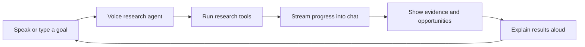
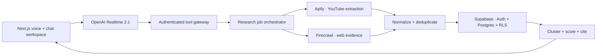
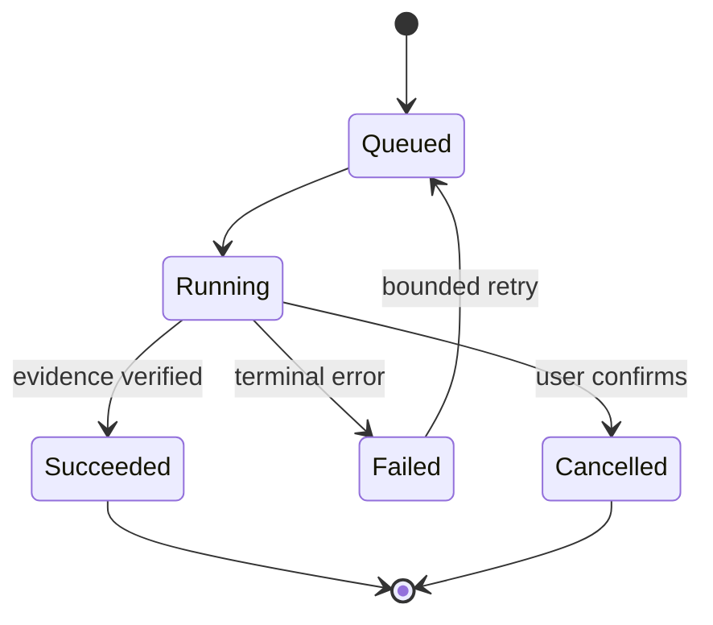
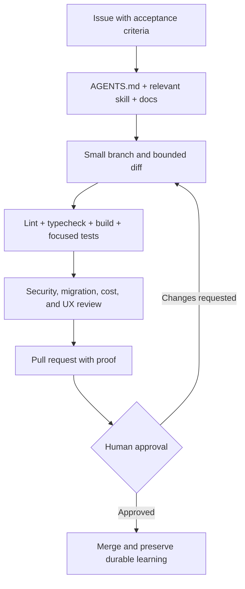
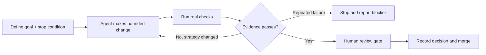
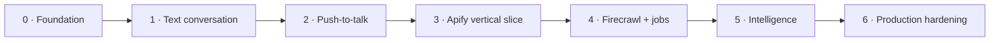

# YT Growth Stack

A voice-first, evidence-backed YouTube competitor research and idea-generation agent. Speak or type a research goal; the agent coordinates Apify, Firecrawl, and Supabase, then returns cited opportunities in a conversational workspace.

> Status: open-source foundation. The interface, contracts, schema, safety boundaries, and delivery system are implemented. Live provider calls require your own credentials and provider-specific job configuration.

## Product experience



Example conversation:

```text
You: Research these five AI productivity channels. Find topics gaining momentum
     that they have not covered well.

Agent: I’ll collect their recent videos, compare topic coverage, and check the
       wider web for demand signals. I’ll show the evidence behind every idea.

Agent: I found an early opportunity: “Local AI agents for non-engineers.”
       It is supported by 12 competitor videos and 8 external sources.
```

## Product architecture



The browser never receives permanent provider credentials. It asks the Next.js server for a short-lived Realtime session credential. Apify, Firecrawl, and Supabase privileged operations remain server-side.

## Research lifecycle



## Agent-readable repository

```text
src/
├── app/                    # Routes, layouts, and server endpoints
├── features/               # User-facing product capabilities
├── integrations/           # OpenAI, Apify, Firecrawl, Supabase boundaries
├── server/                 # Tool registry, jobs, analysis, repositories
└── shared/                 # Cross-cutting configuration and types
supabase/migrations/        # Versioned database changes
skills/                     # Repeatable agent workflows
 docs/
├── product/                # Vision and vocabulary
├── architecture/           # System decisions and diagrams
└── runbooks/               # Operational recovery procedures
.github/                    # CI and pull-request workflow
AGENTS.md                   # Durable instructions for coding agents
```



## Loop engineering

Loop engineering designs the repeatable control system around an agent rather than relying on one large prompt.



Rules: retries are bounded; a retry must change strategy; database migrations, secrets, production cost, destructive actions, and merges require human gates; “done” is a claim supported by current evidence.

## Build roadmap



## Getting started

Requirements: Node.js 20+, npm, and a Supabase project.

```bash
npm install
copy .env.example .env.local
npm run dev
```

Open `http://localhost:3000`. Check provider configuration at `GET /api/health`.

Required environment variables are documented in `.env.example`. Never expose server keys with a `NEXT_PUBLIC_` prefix. The default voice model is `gpt-realtime-2.1`.

## Verification

```bash
npm run lint
npm run typecheck
npm run build
# or all three
npm run verify
```

## Styling and tweakcn

The temporary theme is defined as CSS variables at the top of `src/app/globals.css`. Replace those tokens with your exported tweakcn theme. Styling is kept separate from provider and domain logic.

## Contributing

Read `AGENTS.md`, choose the relevant workflow under `skills/`, open a focused issue, and submit a small pull request with verification evidence. See `CONTRIBUTING.md`.

## License

MIT © 2026 Anup Shah. See `LICENSE`.
