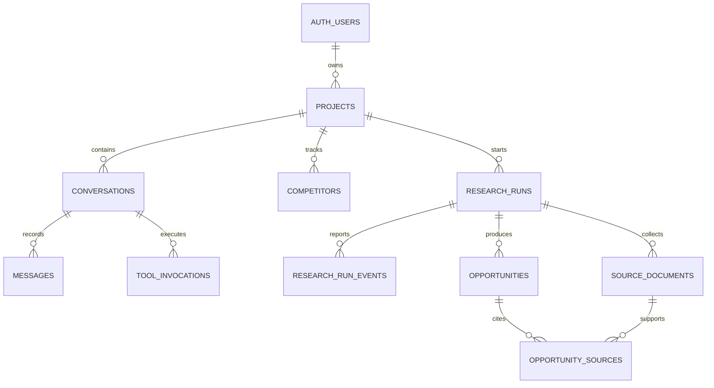

# Data model and ownership

Every user-visible record inherits ownership from `projects.owner_id`. Child tables avoid copying `owner_id`; RLS follows foreign keys to the project as the single source of truth.

`source_documents` preserves provider, URL, capture time, normalized text, and raw payload. `opportunity_sources` is authoritative for new evidence links; the old `evidence_ids` array remains temporarily for compatibility.

`research_run_events` is append-oriented history while `research_runs.status` is the current snapshot. `tool_invocations` stores validated arguments and sanitized outcomes. Credentials, authorization headers, short-lived Realtime secrets, and unfiltered provider errors must never be persisted.

Workspace tabs use durable database state rather than browser memory:

- `conversations.updated_at` is touched when a message is inserted or updated, so the conversation list reflects recent activity.
- `messages.client_id` is an optional client-generated UUID. The unique `(conversation_id, client_id)` index makes retries idempotent without changing existing server-created messages.
- `opportunities.state` is `candidate`, `saved`, or `dismissed`; generated ideas default to `candidate` and only the owning project can change them.
- Composite indexes support newest-first conversation, message, run, source, and filtered opportunity lists. Pagination must use the timestamp plus `id` as a stable cursor.

Browser access uses an authenticated user JWT and RLS. A service-role key bypasses RLS, so privileged server workflows must independently establish user and project ownership. Never expose it to the browser.
