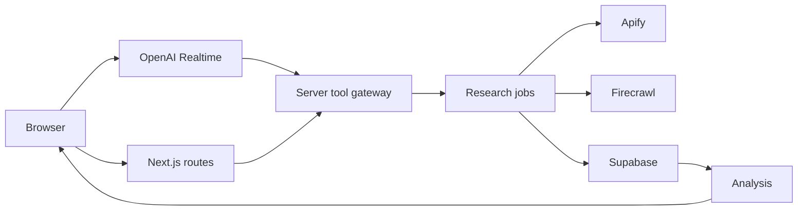

# System overview

The application is a modular Next.js monolith. This keeps deployment and authentication simple while preserving boundaries that can be extracted later.

## Boundary rules
Client code may use only browser-safe Supabase credentials and short-lived Realtime credentials. Provider adapters are server-only. Domain workflows depend on small internal interfaces instead of provider SDK response types.
